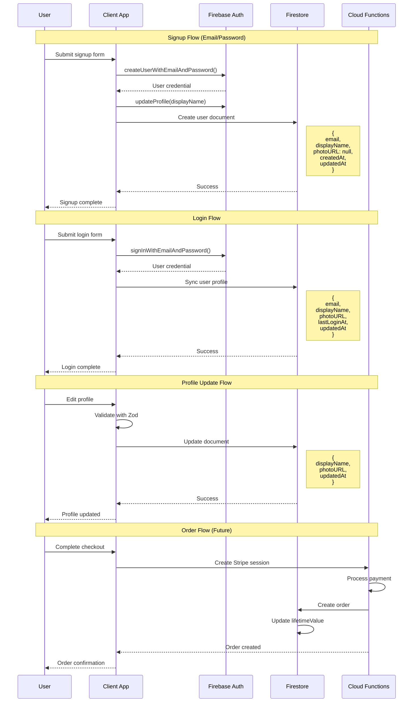
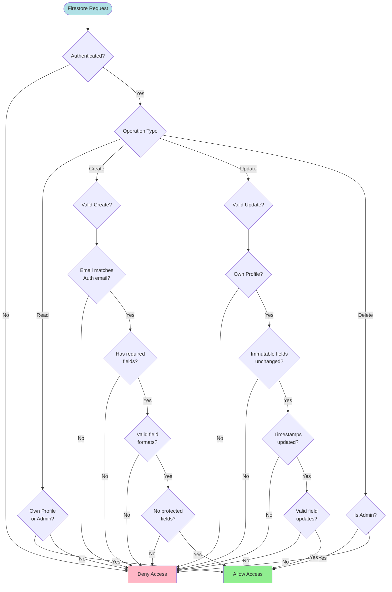
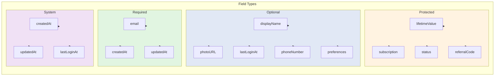
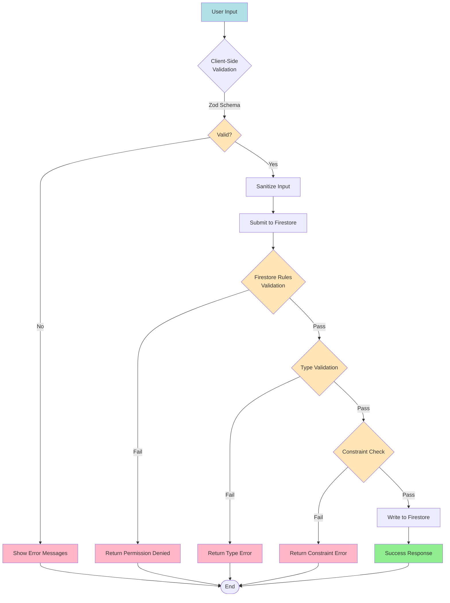
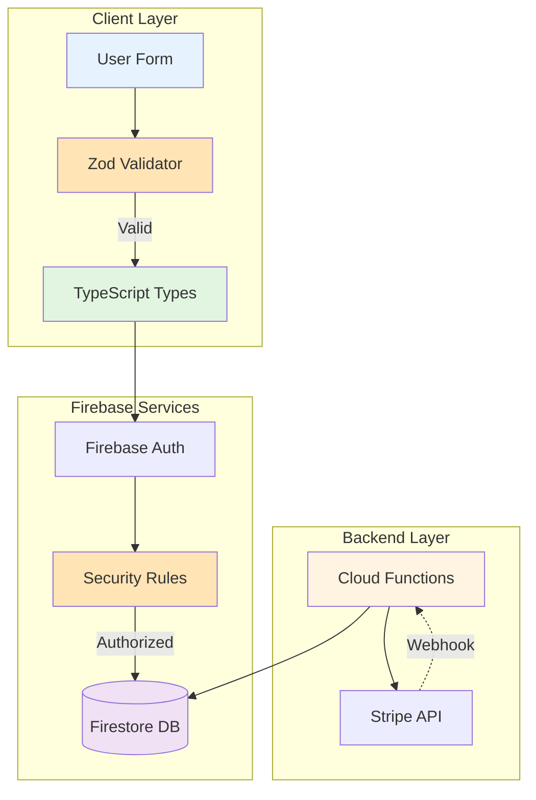
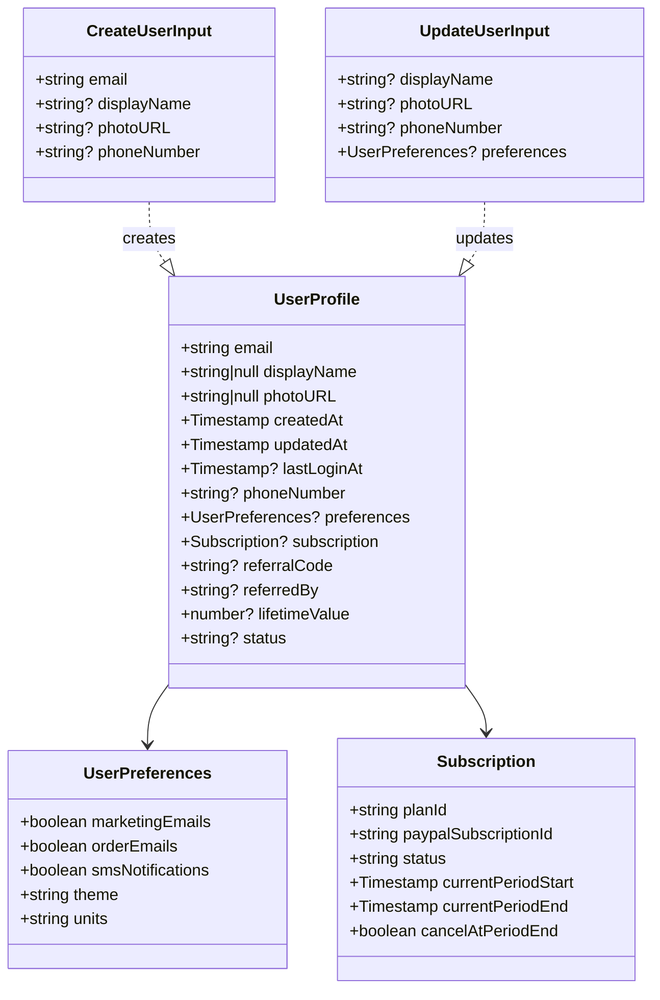
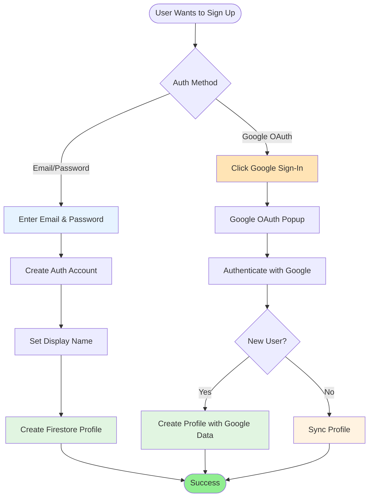
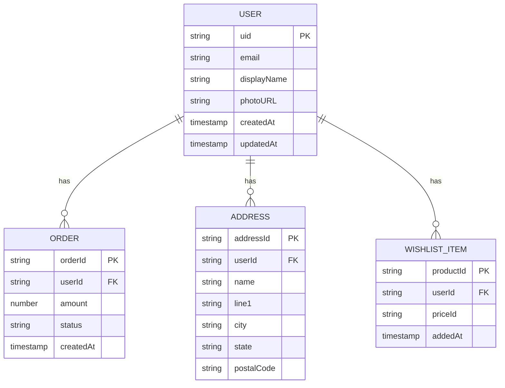
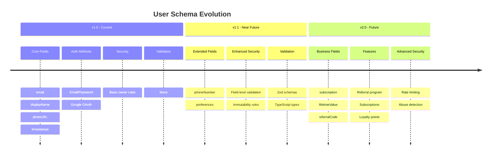
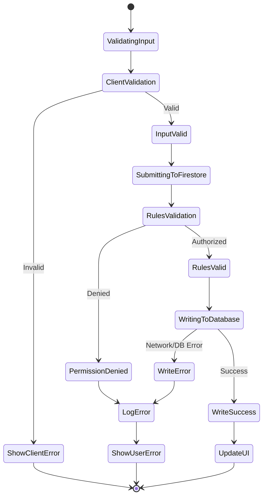

# User Schema Diagrams

Visual representations of the Firestore user schema structure, relationships, and data flows.

## Collection Structure

```mermaid
graph TB
    subgraph "Firestore Database"
        Users[users Collection]

        subgraph "User Document: users/{uid}"
            UID[uid: string]
            Email[email: string*]
            DisplayName[displayName: string | null]
            PhotoURL[photoURL: string | null]
            CreatedAt[createdAt: Timestamp*]
            UpdatedAt[updatedAt: Timestamp*]
            LastLoginAt[lastLoginAt: Timestamp]
            PhoneNumber[phoneNumber: string | null]
            Preferences[preferences: object]
            Subscription[subscription: object]
            ReferralCode[referralCode: string]
            ReferredBy[referredBy: string | null]
            LifetimeValue[lifetimeValue: number]
            Status[status: string]
        end

        subgraph "Subcollections"
            Orders[orders/{orderId}]
            Addresses[addresses/{addressId}]
            Wishlist[wishlist/{productId}]
        end

        Users --> UID
        UID --> Orders
        UID --> Addresses
        UID --> Wishlist
    end

    style Email fill:#e1f5e1
    style CreatedAt fill:#e1f5e1
    style UpdatedAt fill:#e1f5e1
    style Orders fill:#ffe1e1
    style LifetimeValue fill:#fff3e1
    style Subscription fill:#fff3e1
```

*Required fields shown in green*
*Read-only subcollections shown in red*
*Protected fields shown in yellow*

---

## User Lifecycle Flow



---

## Security Rules Flow



---

## Field Validation Matrix



---

## Validation Pipeline



---

## Data Flow Diagram



---

## Type System Architecture



---

## Authentication Methods



---

## Subcollection Relationships



---

## Schema Evolution Path



---

## Error Handling Flow



---

## Legend

### Colors
- **Green** (#e1f5e1): Required fields or successful states
- **Red** (#ffe1e1): Restricted or error states
- **Yellow** (#fff3e1): Protected or warning states
- **Blue** (#e1e8f5): Optional or informational states
- **Purple** (#f0e1f5): System-managed fields

### Symbols
- **\*** : Required field
- **?** : Optional field
- **PK** : Primary key
- **FK** : Foreign key
- **-->** : Data flow direction
- **-.->** : Asynchronous/webhook flow

---

## Additional Resources

- See `USER_SCHEMA_DOCUMENTATION.md` for detailed field descriptions
- See `INTEGRATION_GUIDE.md` for implementation guidance
- See `user-schema.ts` for TypeScript definitions
- See `firestore-rules-users.rules` for security rules

---

**Diagram Version**: 1.0
**Last Updated**: 2026-02-01
**Generated by**: Mermaid.js
